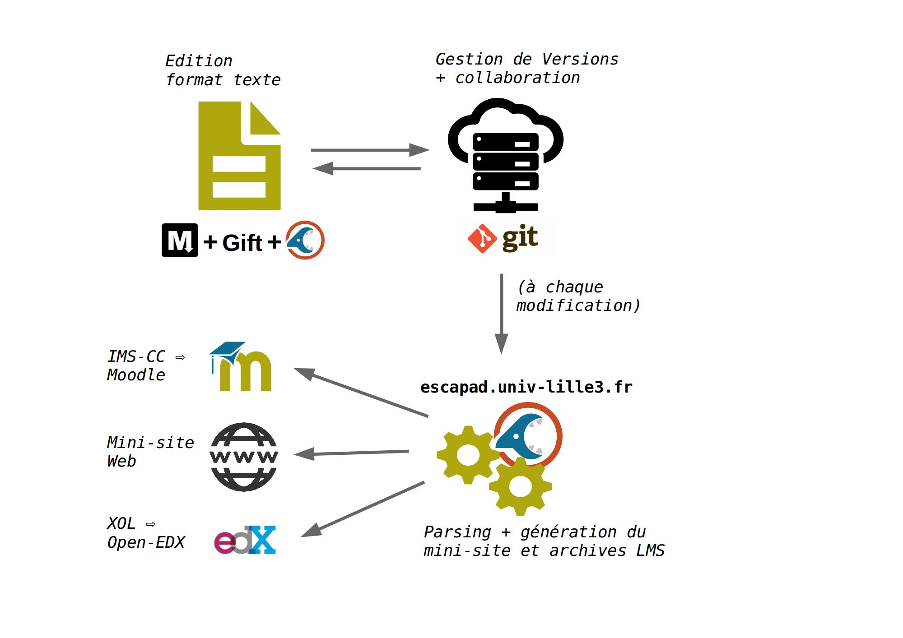

Guide d'utilisation
====================


cnParser est une API et un ensemble de scripts pour transformer des documents rédigés en Markdown (plus quelques extensions) dans des modules pour Moodle ou EDX (des LMS ou Learning Managements Systems) ou encore pour produire un site HTML. 

## Principe général

Le principe de cnParser  consiste à transformer une arborescence de modules de cours en différents formats d'exports (mini-site web et archives pour LMS). Le point de départ est donc un dossier contenant un ou plusieurs modules de cours, appelé "programme de cours", à l'instar des cours [Culture Numérique](https://culturenumerique.univ-lille3.fr/) qui comprennent plusieurs modules et qui sont générés à partir des sources disponibles sur [ce dépôt GitHub](https://github.com/CultureNumerique/cn_modules).

Chaque module de cours doit suivre la syntaxe qui est basée sur le format Markdown pour le contenu de cours, et sur le format GIFT pour la rédaction de quiz. Les fichiers source doivent ensuite suivre une structuration définie dans la [section syntaxe](syntaxe.html). Le résultat de l'export est un dossier contenant un mini-site Web (un dossier de fichiers HTML) reprenant tous les modules de cours et incluant les liens vers des archives IMSCC et EDX (e.g [réutiliser le module CultureNumerique - Internet](https://culturenumerique.univ-lille3.fr/module1.html#sec_A) ). Pour plus de détails sur l'usage des archives EDX et IMSCC-Moodle, et les correspondances adoptés avec le modèle Esc@pad, voir le chapitre  [export](export.html).

L'illustration ci-dessous reprend la chaine éditoriale complète:

1. Le point de départ est un fichier source au format Markdown+GIFT et structuré selon les guides Culture Numérique. Il peut s'éditer depuis n'importe quel éditeur de texte.
2. Les fichiers sources sont synchronisés sur une plateforme git
3. à chaque modification, le service hébérgé sur escapad.univ-lille3.fr régénère le mini-site web et les archives IMSCC-Moodle et EDX.



## Edition du contenu

La structure d'un programme de cours est la suivante:


    - module1/
	  - moncours.md
	  - media/
		- uneimage.png
		- image2.jpg
		- logo.png 
	- templates/
      - logo.png
      - title.md
	  - home.{html,md}
	  - module.tmpl
	  - site_layout.tmpl
	  - index.tmpl
	  - static/
	     - img/
		 - css/
		 - ...
	 

- un programme de cours se décompose en "modules" chacun contenu dans un dossier nommé `moduleX` avec `X` le numéro de chaque module qui déterminera l'ordre dans lequel les modules sont rangés.
- dans chaque dossier de module, il y a un fichier d'extension `.md` (par exemple `moncours.md`) et un dossier `media` contenant les images insérées dans chaque module de cours. La syntaxe utilisé pour éditer le fichier `moncours.md` un module de cours est expliquée sur [cette page](syntaxe.html)

Ensuite, pour personnaliser le mini-site qui sera généré par l'application, vous pouvez modifier les autres fichiers:

- pour personnaliser le logo remplacez le fichier `logo.png` par le fichier de votre choix que vous renommerez `logo.png|jpg|gif` en fonction du type d'image utilisée.
- enfin, pour personnaliser le titre de votre programme de cours, éditer le fichier `title.md` et, sans le renommer, insérez votre titre en première ligne.
- les fichiers `tmpl`, qui permettent de personnaliser la structure de la page d'accueil, des modules ou du site en général. Le format est celui de [jinja2](http://jinja.pocoo.org/).


## Générer le site vitrine et les archives

Une fois que vous avez modifié votre contenu et mis à jour votre dépôt git, vous pouvez passer à l'étape de génération du site vitrine et des archives IMS et EDX.

### Utilisation des programmes de conversion (TODO)

En supposant que vous disposez d'un dossier local `mon_dossier_de_cours` contenant votre contenu de cours structuré en respectant [le guide d'utilisation](usage.html) et la [syntaxe Esc@pad](syntaxe.html),  le script `cnparser` vous permet d'obtenir un export Web contenant les archives importable dans Moodle ou EDX. L'usage de base est le suivant:

```
$ python cnparser.py -r chemin/vers/mon_dossier_de_cours -d /chemin/vers/dossier/cible [OPTIONS]
```

Cette commande génère uniquement le mini site web reprenant tous les modules présent dans le dossier `mon_dossier_de_cours`. Les options suivantes sont disponibles (et doivent être placées à la suite de la commande ci-dessus à la place de `[OPTIONS]`):

- `-m moduleX moduleY ` : exporte uniquement les modules contenus dans les dossiers de module `moduleX`, `moduleY`
- `-i` : génère en plus l'archive IMSCC (IMS Common Cartridge) de chaque module de cours et la place dans le dossier d'export de chaque module avec le nom `moduleX.imscc.zip`
- `-e` : génère en plus l'archive EDX de chaque module de cours et la place dans le dossier d'export de chaque module avec le nom `moduleX_edx.tar.gz`
- `-f` : inclue les feedbacks dans l'export HTML, i.e dans le minisite.


### Importer dans EDX

Dans le studio EDX, une fois dans la page de votre cours (la fonction "créer un cours
depuis une archive EDX" n'est à notre connaissance pas encore disponible), cliquez sur "importer".
Suivez ensuite les étapes. Plus d'explications [ici](http://edx.readthedocs.io/projects/edx-partner-course-staff/en/latest/releasing_course/export_import_course.html)


### Importer l'IMS-CC dans Moodle

Esc@pad peut générer un fichier `module_folder.imscc.zip` qui peut
être importé dans Moodle en tant que cours (cf [restauration d'un cours
depuis une archive IMSCC sous Moodle](https://docs.moodle.org/28/en/IMS_Common_Cartridge_import_and_export)).

1. Allez dans *Administration > Administration du cours > Restauration*
2. Selectionnez votre archive avec *Choisir un fichier..* ou glisser la dans l'emplacement flêché.
3. Appuyer sur *RESTAURATION*
4. Choisissez les différentes options suivant vos préférences.
5. **ATTENTION** Dans la partie 4, pour ne pas perdre vos droits d'enseignant, mettez *'Oui'* pour *Conservez vos rôles et droits d'accès actuels* et oui également si vous souhaitez conserver les groupes.
6. Votre cours s'est normalement généré.

Cette archive contient également toutes les activités avec les questions
associées déjà intégrées.


### Afficher les bonnes réponses et les feedbacks dans le site vitrine

Il est possible d'activer l'option permettant d'afficher les réponses et les feedbacks des questions des tests inclus dans *tous* les modules pour la version Web uniquement (les autres exports LMS contiennent dans tous les cas les bonnes réponses, mais qui ne s'affichent que sous certains conditions, selon les réglages propre à votre instance de LMS).

